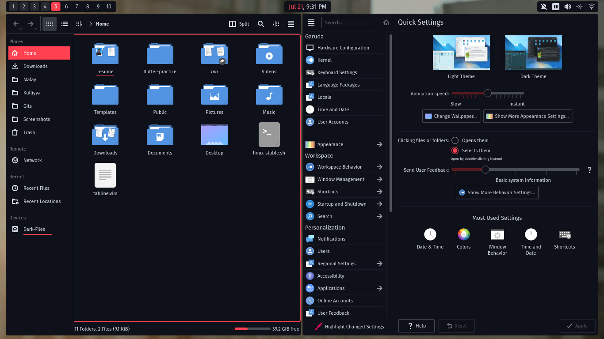

## Material Ocean Nomad

Material oceanized theme with nomad icons for KDE plasma

## included

- desktop theme
- color scheme

## Installation:

#### From source:

- `git clone https://github.com/material-ocean/Plasma.git`
- `cd Plasma`
- `sh install.sh`

## Screenshots:

> wm: bspwm([dotfiles](https://github.com/Blacksuan19/Dotfiles))

> Desktop:

For more KDE Plasma themes check out my
[themes repo](https://github.com/Blacksuan19/Plasma-Themes)

## Licensing:

> licensed under GNU's GPL 3, see
> [LICENSE](https://github.com/material-ocean/Material-Ocean/blob/master/LICENSE).
> for more info

##### Credit:

- nomad project for panel icons.
